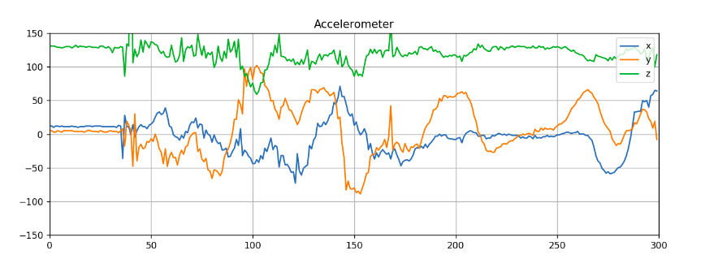

# MiBand-HRX
Library to work with Xiaomi MiBand HRX Edition Accelerometer Data(Support python2/python3). Intended for extraction of accelerometer data only,
for experimentaions with ROS and gesture recognition.

I couldn't find a solution that worked with MiBand HRX edition as the HRX edition.

The below commands were helpful in identification of services and characteristics specific to HRX bands. Xiaomi doesn't provide user descriptions for the services and characteristics.
List services
```sh
    gatttool -b <MAC-ADDRESS> -t random --primary
    ```
List characteristics
```sh
    gatttool -b <MAC-ADDRESS> -t random --characteristics
```

Forked from [creotiv/MiBand2](https://github.com/creotiv/MiBand2)

# BLE
- Authentication is same as MiBand2
- Services & Characteristics of interest

    - ``SERVICE_MIBAND1 : "0000fee1-0000-1000-8000-00805f9b34fb"``
        - ``CHARACTERISTIC_SENSOR_CONTROL : "00000001-0000-3512-2118-0009af100700"``
        - ``CHARACTERISTIC_SENSOR_MEASURE : "00000002-0000-3512-2118-0009af100700"``

- To receive accelerometer notification
    - Write without response ``0x010119`` to service ``0000fee1-0000-1000-8000-00805f9b34fb`` characeteristic ``00000001-0000-3512-2118-0009af100700``
    - Write without response ``0x02`` to service ``0000fee1-0000-1000-8000-00805f9b34fb`` characeteristic ``00000001-0000-3512-2118-0009af100700``
    - Write ``0x0100`` to notification descriptor to enable notification

# Processing Accelerometer Data

Data received in packets of byte size ``20``, ``14`` or ``8``.

Sample: ``0x0100 0500 8200 0b00 0400 8000 0b00 0300 8100 0b00``


|0100  | 0500  | 8200  | 0b00 | 0400  | 8000  | 0b00  | 0300  | 8100  | 0b00   |
|:-:|:-:|:-:|:-:|:-:|:-:|:-:|:-:|:-:|:-:|
| -  | signed x  |signed y   | signed z  |  signed x |  signed y | signed z  | signed x  | signed y  |  signed z |





# Sources & References
1) Base lib provided by [Leo Soares](https://github.com/leojrfs/miband2)
2) [Volodymyr Shymanskyy](https://github.com/vshymanskyy/miband2-python-test)
3) [Freeyourgadget team](https://github.com/Freeyourgadget/Gadgetbridge/tree/master/app/src/main/java/nodomain/freeyourgadget/gadgetbridge/service/devices/huami/miband2)
4) [ragcsalo's comment](https://github.com/Freeyourgadget/Gadgetbridge/issues/63#issuecomment-493740447)
5) [Xiaomi band protocol analyze](http://changy-.github.io/articles/xiao-mi-band-protocol-analyze.html)


# Run 

1) Install dependencies
```sh
pip install -r requirements.txt
```
2) Turn on your Bluetooth
3) Unpair you MiBand2 from current mobile apps
4) Find out you MiBand2 MAC address
```sh
sudo hcitool lescan
```
5) Run this to auth device
```sh
python example.py --mac MAC_ADDRESS --init
```
6) Run this to call demo functions
```sh
python example.py --standard --mac MAC_ADDRESS
python example.py --help
```
7) If you having problems(BLE can glitch sometimes) try this and repeat from 4)
```sh
sudo hciconfig hci0 reset
```
Also there is cool JS library that made Volodymyr Shymansky https://github.com/vshymanskyy/miband-js

# Donate
If you like what im doing, you can send me some money for pepsi(i dont drink alcohol). https://www.paypal.me/creotiv
